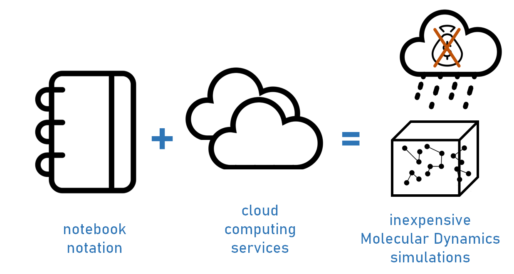

## Making it rain
Cloud-based molecular simulations for everyone
## Hello there!

Welcome to Making it rain page, here you can find a Jupyter notebook scripts for running Molecular Dynamics (MD) simulations using OpenMM engine and AMBER and CHARMM force fields files on Google Colab. This site is a supplementary material of the paper "***Making it rain: Cloud-based molecular simulations for everyone***" and we encourage you to read it before using this pipeline.

The main goal of this work is to demonstrate how to harness the power of cloud-computing to run microsecond-long MD simulations in a cheap and yet feasible fashion.

- **AMBER**   - `Using AMBER to generate topology and to build the simulation box`
- **CHARMM**  - `Using inputs from CHARMM-GUI solution builder`
- **AlphaFold2+MD**  - `Using AlphaFold2_mmseqs2 to generate protein model + MD simulation using AMBER to generate topology and to build simulation box`

## Bugs
- If you encounter any bugs, please report the issue [here](https://github.com/pablo-arantes/Making-it-rain/issues).

## Acknowledgments

- We would like to thank the OpenMM team for developing an excellent and open source engine. 
- We would like to thank the AlphaFold team for developing an excellent model and open sourcing the software. 
- Credit to Sergey Ovchinnikov ([@sokrypton](https://twitter.com/sokrypton)), Milot Mirdita ([@milot_mirdita](https://twitter.com/milot_mirdita)) and Martin Steinegger ([@thesteinegger](https://twitter.com/thesteinegger)) for their fantastic [ColabFold](https://github.com/sokrypton/ColabFold).
- A Making it rain by **Pablo R. Arantes** ([@pablitoarantes](https://twitter.com/pablitoarantes)), **Marcelo D. Polêto** ([@mdpoleto](https://twitter.com/mdpoleto)), **Conrado Pedebos** ([@ConradoPedebos](https://twitter.com/ConradoPedebos)) and **Rodrigo Ligabue-Braun** ([@ligabue_braun](https://twitter.com/ligabue_braun)).
- Also, credit to [David Koes](https://github.com/dkoes) for his awesome [py3Dmol](https://3dmol.csb.pitt.edu/) plugin.
- Finally, we would like to thank Professor [Giulia Palermo](https://palermolab.com/) for her support and thoughtful comments in the development of the present work.

## Do you want to cite this work?

Arantes P.R., Depólo Polêto M., Pedebos C., Ligabue-Braun R. Making it rain: cloud-based molecular simulations for everyone. 
ChemRxiv. doi: [10.33774/chemrxiv-2021-9f2m5](https://doi.org/10.33774/chemrxiv-2021-9f2m5) (2021).

